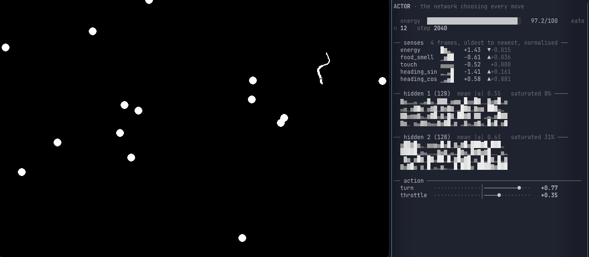

# C. Elegans. Simulation

```
⣿⣿⣿⣿⣿⣿⣿⣿⣿⣿⣿⣿⣿⣿⣿⣿⣿⣿⣿⣿⣿⣿⣿⣿⣿⣿⣿⣿⣿⣿⣿⣿⣿⣿⣿⣿⣿⣿⣿⣿⣿⣿⣿⣿⣿⣿⣿⣿⣿⣿⣿⣿⣿⣿⣿⣿⣿⣿⣿⣿
⣿⣿⣿⣿⣿⣿⣿⣿⣿⣿⣿⣿⣿⣿⣿⣿⣿⣿⣿⣿⣿⣿⣿⣿⣿⣿⣿⣿⣿⣿⠟⠏⠃⠃⠃⠏⢿⣿⣿⣿⣿⣿⣿⣿⣿⣿⣿⣿⣿⣿⣿⣿⣿⣿⣿⣿⣿⣿⣿⣿
⣿⣿⣿⣿⣿⣿⣿⣿⣿⣿⣿⣿⣿⣿⣿⣿⣿⣿⣿⣿⣿⣿⣿⣿⣿⣿⣿⠟⠇⠀⠀⠀⠀⠀⠀⠀⠀⠋⣿⣿⣿⣿⣿⣿⣿⣿⣿⣿⣿⣿⣿⣿⣿⣿⣿⣿⣿⣿⣿⣿
⣿⣿⣿⣿⣿⣿⣿⣿⣿⣿⣿⣿⣿⣿⣿⣿⣿⣿⣿⣿⣿⣿⣿⣿⣿⡿⠁⠀⠀⠀⠀⠀⠀⠀⠀⠀⠀⠀⠊⣿⣿⣿⣿⣿⣿⣿⣿⣿⣿⣿⣿⣿⣿⣿⣿⣿⣿⣿⣿⣿
⣿⣿⣿⣿⣿⣿⣿⣿⣿⣿⣿⣿⣿⣿⣿⣿⣿⣿⣿⣿⣿⣿⣿⡿⠇⠀⠀⠀⢀⣸⣾⣿⣿⣔⠀⠀⢀⣀⠀⢫⣿⣿⣿⣿⣿⣿⣿⣿⣿⣿⣿⣿⣿⣿⣿⣿⣿⣿⣿⣿
⣿⣿⣿⣿⣿⣿⣿⣿⣿⣿⣿⣿⣿⣿⣿⣿⣿⣿⣿⣿⣿⡿⠇⠀⠀⠀⢀⣸⣿⣿⣿⣿⣿⣿⡐⠀⠀⠀⠀⠊⣿⣿⣿⣿⣿⣿⣿⣿⣿⣿⣿⣿⣿⣿⣿⣿⣿⣿⣿⣿
⣿⣿⣿⣿⣿⣿⣿⣿⣿⣿⣿⣿⣿⣿⣿⣿⣿⣿⡿⠟⠃⠀⠀⠀⢀⣸⣿⣿⣿⣿⣿⣿⣿⣿⡕⠀⠀⠀⠀⠀⣿⣿⣿⣿⣿⣿⣿⣿⣿⣿⣿⣿⣿⣿⣿⣿⣿⣿⣿⣿
⣿⣿⣿⣿⣿⣿⣿⣿⣿⣿⣿⣿⠏⠏⠏⠇⠃⠁⠀⠀⠀⠀⣠⣼⣿⣿⣿⣿⣿⣿⣿⣿⣿⣿⠕⠀⠠⠀⠌⠐⣿⣿⣿⣿⣿⣿⣿⣿⣿⣿⣿⣿⣿⣿⣿⣿⣿⣿⣿⣿
⣿⣿⣿⣿⣿⣿⣿⣿⣿⣿⣿⣿⣿⣽⣼⣰⣐⣀⣰⣸⣼⡿⠿⠿⠟⠏⠏⠏⠇⠃⠃⠃⠃⠁⠀⠀⠠⠀⠀⢠⣿⣿⣿⣿⣿⣿⣿⣿⣿⣿⣿⣿⣿⣿⣿⣿⣿⣿⣿⣿
⣿⣿⣿⣿⣿⣿⣿⣿⣿⣿⣿⣿⣿⣿⣿⣿⣿⡿⠇⠁⠀⠀⠀⡀⠀⠀⠀⠐⠀⠀⠀⡐⢠⠀⠈⠀⠀⠀⣨⣿⠟⠃⠁⠀⠃⠋⠿⣿⣿⣿⣿⣿⣿⣿⣿⣿⣿⣿⣿⣿
⣿⣿⣿⣿⣿⣿⣿⣿⣿⣿⣿⣿⣿⣿⣿⡿⠇⠀⠀⠀⠀⠀⠀⠀⠀⠀⠀⠀⠀⠀⠀⠁⠀⠀⢀⣠⣸⣿⣿⣿⣼⣼⣴⣐⠀⠀⠀⠋⣿⣿⣿⣿⣿⣿⣿⣿⣿⣿⣿⣿
⣿⣿⣿⣿⣿⣿⣿⣿⣿⣿⣿⣿⣿⣿⡿⠁⠀⠀⠀⠀⠀⠀⢀⣠⣰⣰⣰⣰⣼⣼⣼⣼⣿⣿⣿⣿⣿⣿⣿⣿⣿⣿⣿⣿⠀⠀⠀⠀⣿⣿⣿⣿⣿⣿⣿⣿⣿⣿⣿⣿
⣿⣿⣿⣿⣿⣿⣿⣿⣿⣿⣿⣿⣿⣿⠕⠀⠀⠀⠀⠀⢀⣾⣿⣿⣿⣿⣿⣿⣿⣿⣿⣿⣿⣿⣿⣿⣿⣿⣿⣿⣿⣿⡿⠅⠀⠀⠀⠀⣿⣿⣿⣿⣿⣿⣿⣿⣿⣿⣿⣿
⣿⣿⣿⣿⣿⣿⣿⣿⣿⣿⣿⣿⣿⣿⠀⠀⠀⠈⠀⠀⣾⣿⣿⣿⣿⣿⣿⣿⣿⣿⣿⣿⠿⠿⠿⠿⠿⠿⠿⠿⠟⠇⠀⠀⠀⠀⠀⣪⣿⣿⣿⣿⣿⣿⣿⣿⣿⣿⣿⣿
⣿⣿⣿⣿⣿⣿⣿⣿⣿⣿⣿⣿⣿⣿⡐⠀⠀⠀⠀⠀⢿⣿⣿⣿⣿⣿⣿⣿⠟⠇⠁⠀⠀⠀⠀⠀⠀⠀⠀⠀⠀⠀⠀⠀⠀⢀⣸⣿⣿⣿⣿⣿⣿⣿⣿⣿⣿⣿⣿⣿
⣿⣿⣿⣿⣿⣿⣿⣿⣿⣿⣿⣿⣿⣿⣵⠀⠀⠀⠀⠀⠀⠋⠯⠿⠟⠏⠃⠀⠀⠀⠀⠀⠀⠀⠀⠀⠀⠀⠀⠀⠀⣀⣀⣰⣾⣿⣿⣿⣿⣿⣿⣿⣿⣿⣿⣿⣿⣿⣿⣿
⣿⣿⣿⣿⣿⣿⣿⣿⣿⣿⣿⣿⣿⣿⣿⣵⡀⠀⠀⠀⠀⠀⠀⡀⠀⠀⠀⠀⠀⠀⠀⢀⣠⣰⣸⣼⣼⣼⣼⣿⣿⣿⣿⣿⣿⣿⣿⣿⣿⣿⣿⣿⣿⣿⣿⣿⣿⣿⣿⣿
⣿⣿⣿⣿⣿⣿⣿⣿⣿⣿⣿⣿⣿⣿⣿⣿⣽⣐⠀⠀⠀⠀⠀⠀⠀⠀⠀⢀⣠⣸⣾⣿⣿⣿⣿⣿⣿⣿⣿⣿⣿⣿⣿⣿⣿⣿⣿⣿⣿⣿⣿⣿⣿⣿⣿⣿⣿⣿⣿⣿
⣿⣿⣿⣿⣿⣿⣿⣿⣿⣿⣿⣿⣿⣿⣿⣿⣿⣿⣿⣴⣰⣀⣀⣀⣠⣰⣼⣿⣿⣿⣿⣿⣿⣿⣿⣿⣿⣿⣿⣿⣿⣿⣿⣿⣿⣿⣿⣿⣿⣿⣿⣿⣿⣿⣿⣿⣿⣿⣿⣿
⣿⣿⣿⣿⣿⣿⣿⣿⣿⣿⣿⣿⣿⣿⣿⣿⣿⣿⣿⣿⣿⣿⣿⣿⣿⣿⣿⣿⣿⣿⣿⣿⣿⣿⣿⣿⣿⣿⣿⣿⣿⣿⣿⣿⣿⣿⣿⣿⣿⣿⣿⣿⣿⣿⣿⣿⣿⣿⣿⣿⠀⠀⠀⠀⠀⠀⠀⠀⠀⠀
```

This repository is an experiment to create an artificial worm which can sense the environment and act accordingly.
There are no hard coded scenarious everything the worm does is for survival.

## Panel



## Docs 

- [Biology](./notes/biology.md)
- [Training](./notes/training.md)

## Checklist

- [x] Biological Understading
- [x] Environment Creation (Base Environment)
- [ ] Train the behaviour
    - [x] Stage 1 : Food source sensory movement
    - [x] Stage 2 : Other chemical stimulations (toxins)
    - [ ] Stage 3 : Figure out reproduction and population increamental dynamics
    - [ ] Stage 4 : Dauer Stage Experimentation
- [ ] Create environment in rust for esp32
    - [ ] Check memory contraints
    - [ ] Check population growth
    - [ ] Create inference model
- [ ] Transfer the environemnt to hardware
