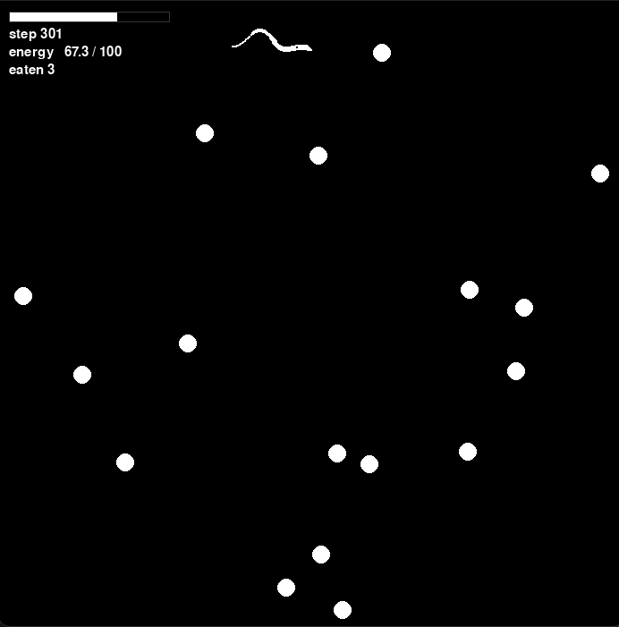

# Training the worm



What PPO is doing, which parameter controls which part of it, and how to tell a
broken run from a slow one.

Claims are labelled: **[measured]** comes from a run or experiment in this
project and is recorded at the bottom; **[standard]** is ordinary PPO practice;
**[reasoning]** is derived but untested here. This document has twice reached a
wrong conclusion by reasoning from a training log, so prefer the measurements.

## 1. What PPO actually does

PPO improves a policy by repeating four steps.

**Collect.** Run the current policy π_old for `steps_per_epoch` steps, storing
each `(observation, action, reward, value, log-probability)`. This is *on-policy*
data: it describes π_old and nothing else.

**Estimate advantage.** For each step, work out how much better the action taken
was than what the critic expected. That is the advantage `A(s,a)`, and it is the
only thing that tells the policy which direction to move.

**Improve.** Take many gradient steps on that one batch, maximising

```
L(θ) = E[ min( r(θ)·A ,  clip(r(θ), 1-ε, 1+ε)·A ) ]      r(θ) = π_θ(a|s) / π_old(a|s)
```

The ratio `r` is what makes reusing one batch legal: it corrects for the fact
that after the first gradient step the data no longer comes from the policy
being improved. The `clip` removes the *incentive* to move any single sample's
probability far, which keeps the correction from exploding.

**Discard and repeat.** The batch is thrown away. PPO never reuses data across
epochs.

Almost every hyperparameter is a knob on one of those four steps.

### What the objective means here

The reward is `+1` per surviving step and nothing else, so the return of an
episode **is its lifespan**, and `V(s)` is approximately the discounted expected
remaining lifespan. That has two consequences worth holding onto:

- The critic is estimating the headline metric directly. Anything that corrupts
  `V(s)` corrupts the thing you are trying to report.
- Eating is never rewarded. Its entire value is that death arrives later, which
  means it is only learnable if "later" falls inside the discount horizon.

---

## 2. Collection

### `steps_per_epoch`

How much experience each policy improvement is based on. Larger batches give
lower-variance advantage estimates and fewer, better updates; smaller batches
give more frequent, noisier ones. **[standard]**

The project-specific constraint is episode count. Statistics like
`lifespan_mean` are computed over episodes that *finished* inside the epoch, so
at fewer than about five per epoch those columns are noise, and at zero they are
NaN. Divide `steps_per_epoch` by the freeze baseline for a lower bound on how
many you get. **[measured]**

### `frame_stack`

Concatenates the last k observation frames. The worm senses one scalar of smell
with no direction and no distance, so a single frame cannot distinguish "on a
rising gradient" from "on a falling one": the environment is partially
observable and a memoryless policy cannot solve it. Stacking turns *how much*
into *more or less than k steps ago*, which is what gradient-following needs.
**[reasoning]**

At `dt = 0.1` and `max_speed = 2.0`, four frames span 0.4 s and 0.8 world units.
Swimming straight over that window changes smell by ~32% of its spatial spread,
and 20% of windows carry essentially no gradient at all. **[measured]**

### `normalize_observations`

Tracks a running mean and variance per channel and standardises the input.
`food_smell` averages ~0.13 while `heading_sin`/`heading_cos` span [-1, 1], so
without it the signal that matters is by far the quietest input to the network.
**[measured]**

The running statistics are *learned state*. They are saved with checkpoints and
frozen during evaluation; a policy restored with a fresh normaliser is fed a
differently-scaled input than it trained on and will quietly underperform.

---

## 3. Credit assignment

### `gamma`, and the one rule that matters most here

γ defines the objective: return is `Σ γ^t r_t`. Its **horizon** is `1/(1-γ)`
steps, beyond which rewards are effectively invisible.

Because eating pays no immediate reward, its whole value lies in deferred
survival. If the worm's lifespan is many horizons long, `V(s)` saturates and
eating changes it by almost nothing. Measured, one pellet's effect on `V(s)`:

| config | freeze life | horizon | ΔV from one pellet |
|---|---|---|---|
| `basal 0.25`, γ=0.99 | 200 | 100 | **+8.41 (9.7%)** |
| `basal 0.15`, γ=0.99 | 533 | 100 | +0.38 (0.4%) |
| …during a 2× eased curriculum | 1067 | 100 | **+0.00 (0.0%)** |
| `basal 0.15`, γ=0.998 | 533 | 500 | **+48.7 (14.8%)** |

**[measured]** The third row is a run that could not possibly learn to eat: at
two decimal places, eating did not change the value of the worm's state. It
trained for 3.5M steps and its fixed-world score went 597 → 564.

> **Rule.** Keep the discount horizon `1/(1-γ)` within roughly 1–3× the freeze
> baseline `initial_energy / basal_cost`. Change one and you must change the
> other. Lengthening the worm's life without raising γ makes it immortal in the
> eyes of the critic, and food worthless to something that cannot die.

### `gae_lambda`

Generalised Advantage Estimation blends n-step returns. λ=0 uses the one-step TD
residual (low variance, high bias; it trusts the critic completely); λ=1 uses
the full Monte-Carlo return (unbiased, high variance). 0.97 sits near the
unbiased end while damping some of the noise. **[standard]**

### Death versus timeout

Not a config value, but the most consequential line in the buffer. When a
trajectory ends, GAE needs the value of whatever follows it:

- **Death** → `0.0`. Nothing follows; all future reward is forfeit.
- **Time limit or epoch boundary** → `V(s_T)`. The trajectory was cut short by
  our bookkeeping, not by the world.

Conflating them teaches the critic that surviving to the cap is worth nothing
beyond it, and under a survival reward, that is a direct corruption of the
metric. `test_collect_bootstraps_deaths_at_zero_and_cutoffs_at_v` asserts it
against the live rollout loop.

Watch `death_rate`. While it sits at 1.00 the timeout branch is never exercised;
once a competent policy starts hitting the cap, it matters, and the cap also
begins censoring the top of your measured distribution.

---

## 4. The update

### `clip_ratio` (ε)

The width of the trust region. Beyond `1±ε`, a sample's contribution to the
objective goes flat and its gradient vanishes, so there is no incentive to push
any single action's probability further. It bounds the *incentive*, not the
policy: many individually-clipped-but-inside steps still compound. **[standard]**

Watch `clip_frac`. Above ~0.3, most samples are at the boundary and the learning
rate is too high for the data.

### `policy_iters` and `target_kl`

`policy_iters` is how many gradient steps to take on one batch. More is more
sample-efficient, but each step makes the batch staler: the importance ratio's
variance grows as π_θ moves from π_old, and the surrogate is only a local
approximation of true improvement. From the TRPO bound (Schulman et al. 2015),
real improvement equals the surrogate minus an error term that grows with the KL
between old and new; past a point, maximising the surrogate *reduces*
performance.

`target_kl` is the backstop. Iteration stops when the approximate KL exceeds
1.5× it. Read `stop_iter` in the log:

- Pinned at 2–5: updates are trying to move much further than the data
  supports. Lower `policy_lr`.
- Always equal to `policy_iters`: the guard never fires and steps are tiny.
  Raise `policy_lr`.

The logged `kl` is `mean(logp_old - logp)`, an unbiased but high-variance
estimator that **can come out negative** on a finite sample. That is an
artefact, not a bug. **[standard]**

### `policy_lr`, `value_lr`, `value_iters`, `max_grad_norm`

Ordinary optimiser knobs, with one project-specific coupling: raising γ raises
the scale of `V(s)`. At γ=0.99 values top out near 100; at γ=0.998 near 500. The
critic's targets and therefore its gradients grow with it, so a `value_lr` that
was stable before may not be. If `loss_v` oscillates or `delta_loss_v` turns
positive, that is the first thing to pull back. **[reasoning]**

### Advantage normalisation

Advantages are standardised to zero mean and unit variance before the update.
Two consequences:

- A constant added to every episode's return **has no effect whatsoever**. This
  is why `reward.death_penalty` is inert while `death_rate` is 1.00: every
  episode gets the same penalty, and normalisation removes it exactly.
  **[measured]**: normalised advantages were bit-identical with and without.
- What matters is not the size of the signal but its size *relative to other
  variance* in the batch, including variance from the per-episode randomisation
  draws.

---

## 5. Entropy: a note

### What it is

For a diagonal Gaussian policy with k action dimensions,

```
H = Σ_i [ log σ_i + ½ log(2πe) ]  =  Σ_i log σ_i  +  k · 1.41894
```

So the `entropy` column in `progress.csv` **is** `log_std` plus a constant, and
nothing else. They are the same curve. Verified against the logs: `log_std`
summing to −2.9694 gives entropy −0.1315, matching the logged −0.132.

This is *differential* entropy, which unlike discrete entropy is not bounded
below by zero. It crosses zero when the geometric mean of σ reaches
`exp(-1.41894) ≈ 0.242`. **A negative value carries no special meaning**: it is
a thermometer, and the only question is which way it is moving.

### Why it always falls

The surrogate objective rewards concentrating probability mass on actions with
positive advantage, and narrowing σ does exactly that. So there is a persistent
downward pressure that is nobody's mistake: it is the objective working.

The entropy bonus pushes back by subtracting `c · H` from the loss. But note
what its gradient is: since `dH/d(log σ_i) = 1`, the bonus contributes a
**constant** `−c` to the gradient on each `log_std`, no matter how far σ has
already fallen. The surrogate's pressure, meanwhile, scales with the advantages.
Once the latter exceeds `c`, σ falls without limit and the bonus never catches
up. That is the precise reason `entropy_coef` is a negotiation the surrogate
eventually wins rather than a guarantee. **[reasoning, from the gradient]**

Observed: with `entropy_coef: 0.01` the bonus won for ~30 epochs (entropy rose
1.88 → 2.20) and then lost for the remaining 470, ending at −0.13 with σ
collapsed from 0.607 to [0.269, 0.191]. **[measured]**

### `entropy_coef` versus `log_std_min`

They are different kinds of thing:

- `entropy_coef` is a **term in the loss**, a trade-off against return, which
  the optimiser is free to lose.
- `log_std_min` is a **hard constraint**, clamped onto the parameter after every
  policy step. It cannot be lost, and it cannot be reasoned about: there is no
  principled value, only guesses.

The implementation detail that matters: the clamp is applied **in place on the
parameter**, not inside the forward pass. Clamping the forward pass would zero
the gradient below the floor, so a parameter that had already drifted under it
could never climb back: it would report the floor forever while the real value
sank. Clamping the parameter keeps it genuinely in range.

One artefact: Adam's momentum does not know about the clamp. While the loss
pushes down persistently and the clamp undoes the result, Adam's first-moment
estimate keeps accumulating downward, so recovery off the floor lags once the
pressure reverses. **[reasoning]**

### The honest evidence

**The floor has never demonstrably helped in this project.**

- Introduced to fix a plateau; the floored and unfloored runs were bit-identical
  until the clamp engaged at epoch 372, and afterwards scored 245.9 vs 244.3,
  well inside the error bars. **[measured]**
- The plateau it was meant to fix was actually caused by γ, the scent field and
  the policy initialisation. Fixing those took the same environment from 1.06×
  the freeze baseline to 2.9×.

### The diagnostic

The only question worth asking about the floor is **pinned or resting?**

```
log_std_min = -1.2 (sigma >= 0.301)   actual sigma [0.30, 0.30]  -> PINNED
log_std_min = -1.6 (sigma >= 0.202)   actual sigma [0.28, 0.27]  -> resting, inert
```

**[measured]**: the same policy, given room, settles at σ ≈ 0.275. The tighter
floor was forcing ~10% more noise than the policy wanted.

- **Resting above**: free insurance against a pathological state. Leave it.
- **Pinned**: you are overriding the optimiser with a guessed number and paying
  for it every step. That is information: ask *why* the policy wants less noise,
  rather than forcing it.

Set it low enough to catch genuine collapse (σ → 0.05, so around `-3.0`) and
treat it as a fuse, not a control.

### What entropy is not

- **Not a progress metric.** It falls in successful and failed runs alike.
- **Not the only exploration.** `mean_bias_init` mattered far more here: a
  zero-mean throttle left an untrained worm diffusing 1.24 units over an entire
  life, with cv 0.00 and 0 of 40 episodes eating. Biasing it forward gave 9.56
  units and cv 0.58: from no learnable signal to a live one, with σ untouched.
  **[measured]**
- **Not necessarily wanted at deployment.** Evaluation takes the distribution's
  mean, and a noise sweep on a trained policy was flat within error across
  σ 0.0–0.60.

The principled alternative to a floor is an entropy *target* with an
auto-tuned multiplier: maximise return subject to `E[H] ≥ H_target`, adapting
the multiplier by gradient descent. That enforces average exploration as a
constraint while letting the policy be locally confident. It is what SAC does
(Haarnoja et al., arXiv:1812.05905; recalled, not verified here).

---

## 6. Exploration and initialisation

### `log_std_init`

The starting σ, so the amount of noise the policy explores with before it has
learned anything. Default `-0.5` gives σ ≈ 0.61 on an action space of [-1, 1].

### `mean_bias_init`

Initial bias per action dimension, `[turn, throttle]`. This is a *prior on
behaviour*, and in this project it was the difference between a learnable task
and a dead one.

Independent per-step Gaussian noise explores badly in continuous control,
because a zero-mean throttle cancels forward against backward and produces
**diffusion rather than travel**:

```
throttle bias   net displacement   eaten   cv
    +0.0                  1.24      0.00   0.00   <- no signal at all
    +0.5                  9.56      0.90   0.58
    +1.0                 11.73      2.05   0.59
```

**[measured]** 0.5 rather than 1.0 because a mean of 1.0 sits exactly on the
action bound, so half the exploration noise would be clipped away from the first
step. It remains an ordinary trainable parameter, and the policy can still learn to
reverse.

### `hidden_sizes`, `activation`

Ordinary capacity knobs. A 64×64 tanh MLP is the spinup reference and was
sufficient to reach 2.9× the freeze baseline.

---

## 7. The environment decides whether PPO can learn at all

No hyperparameter fixes a world that carries no signal. Check these first.

### Is there a signal? Check `lifespan_std / lifespan_mean`

PPO learns from *differences between outcomes*. If every episode returns the
same number, every advantage is the critic's own approximation error and **more
steps will not help**.

- **< 0.05**: dead. Fix the world, not the optimiser.
- **0.2 – 0.6**: healthy.
- **low with `death_rate` well below 1.0** is the mirror failure: everything
  survives to the cap, so outcomes are identical from the easy end.

### The freeze baseline

`initial_energy / basal_cost` is what a worm scores doing *nothing*. It is the
bar, and it moves whenever you touch the metabolism. Note that raising it
compresses the fraction of the return that depends on the policy.

### The ballistic threshold

Whether blind straight-line sweeping is a viable strategy is arithmetic:

```
gain = count · 2·eat_radius · (max_speed·dt) / (width·height)   # pellets per step
     × food_value / basal_cost                                  # steps per pellet
```

Steps of life earned per step lived, sensing nothing. Above 1.0 and blind
sweeping self-sustains, so chemotaxis is optional and will not be learned. On a
torus this is decisive; walls neutralise it, because you cannot sweep a world
you keep colliding with. **[measured]**: on a 20×20 wrap world, blind running
scored 1051 against a freeze baseline of 320 and beat every trained policy of
the time by 3×.

### The scent field must have structure

The field is the *sum* over pellets, so pellets closer together than `2σ`
(where `σ = scent_radius × gaussian_sigma_scale`) merge into a single hill whose
summit lies **between** them, where there is nothing to eat.

```
scent_radius 8.0 (sigma 2.80, merges below 5.60; 12 pellets ~2.89 apart)
     field contrast 0.70   3.5 peaks/world   45.2% of summits have NO food
scent_radius 4.0     contrast 1.29   8.4 peaks   7.9% empty
scent_radius 2.5     contrast 2.02  10.2 peaks   0.0% empty
```

**[measured]** At the top row the whole arena smells roughly the same and nearly
half its peaks are lies. A policy trained there did *better blindfolded* (605
vs 564 lifespan, eating twice as much) because ignoring the channel was
genuinely the better strategy.

Raising `scent_radius` helps a worm detect food at range and destroys its ability
to resolve individual sources. The two are in direct conflict; enforcing a
minimum pellet separation is what would let you have both.

### Per-episode randomisation

`randomization.*_scale` are `[low, high]` multipliers redrawn on every reset.
The worm is never told what it drew, which is the point: a policy trained on one
exact calibration bakes in a fixed relationship between how hard it turns and
how far it travels, and overshoots silently once that changes: a retuned
config, or eventually hardware that does not match the sim.

- `speed_scale`, `turn_rate_scale` multiply the nominal body ceilings. **Not
  sensable**, so the policy must find one strategy that works across the whole
  band. Widening them therefore adds return variance that is *not attributable
  to the policy*, which competes with the signal PPO is trying to extract. At
  `[0.5, 1.5]` the body varies 3× between episodes. **[reasoning]**
- `food_count_scale` multiplies `food.count`. Unlike the actuation draws this
  one **is** sensable (a denser world smells stronger everywhere), so the worm
  can in principle condition its search on ambient concentration. That is the
  roaming/dwelling switch real *C. elegans* has. It also widens the pellet count
  the observation ceiling must cover, and rich draws pack pellets closer, which
  worsens the merging described above.

`enabled: false` pins every draw at its nominal value. Do that when isolating a
bug: anything that pins `food.positions` by hand needs it, since the count moves
underneath otherwise.

### Sensing-free baselines

Two local optima sense nothing, and PPO will settle into either if the world
rewards it. Run both on the *target* config:

| policy | what it is | trap when |
|---|---|---|
| `freeze` | do nothing | moving costs meaningfully more than idling |
| `straight` | commit to the spawn heading | the world wraps |

`greedy` cheats by reading pellet positions and gives the ceiling. The gap
between the best sensing-free baseline and greedy is the headroom chemotaxis can
actually claim.

---

## 8. The curriculum

The env config is the **target**: the world the policy must ultimately handle.
`curriculum.*_start` say only where training *begins*, and each anneals toward
the target over the first `anneal_fraction` of the run, then holds. `null` pins a
parameter at its target throughout.

The purpose is §7's problem: under a hard target world an untrained policy may
produce no outcome variation at all, and PPO cannot learn from a constant.
Starting forgiving makes outcomes differ; annealing back down restores the
pressure to actually follow the gradient, which a permanently rich world removes.

| parameter | what it eases | cost |
|---|---|---|
| `food_count_start` | more pellets to stumble into | raises the ballistic gain; packs pellets closer, worsening merged summits |
| `eat_radius_start` | wider mouth | raises the ballistic gain |
| `scent_radius_start` | food smellable further off | merges neighbouring pellets into food-free summits |
| `metabolism_scale_start` | divides `basal_cost` **and** `move_cost`, so the worm lives longer | pushes eating past the γ horizon |

Two things follow from that table.

**Scale both metabolic rates together, never one.** Dividing both is a pure time
dilation: lifespan-without-food and steps-bought-per-pellet grow by the same
factor, so the food economics are unchanged and `basal` keeps dominating `move`.
Easing only `basal` would make full-effort movement cost more than idling and
hand PPO the freeze trap directly. 2.0 gave the widest spread of outcomes on the
starting world (cv 0.49 against 0.32 at 1.0); **larger is not better**: at 8.0
the spread collapses to 0.09 because 85% of episodes hit the step cap, which is
the same no-signal problem arriving from the easy end. **[measured]**

**`scent_radius` is the only knob that eases sensing without also easing blind
foraging**: it does not appear in the ballistic-gain formula at all. That makes
it the right primary axis if the goal is chemotaxis rather than bumping, but only
if pellet separation keeps its summits honest. **[reasoning]**

**Anneal downward only.** The `food_smell` observation ceiling is fixed when the
environment is built, from the *starting* count. Density that rose later would be
silently clipped.

`anneal_fraction` below 1.0 leaves a consolidation window in which the policy is
trained, and evaluated, on the real thing. Note the danger the fixed yardstick
exists to catch: while the curriculum runs, a *declining* `lifespan_mean` may
simply be the world tightening faster than the policy improves, and only a
fixed-world evaluation can tell the two apart.

---

## 9. Diagnosis

### Rule 0: the training log cannot tell you whether the policy improved

With the curriculum on, the world changes underneath the policy, so a falling
`lifespan_mean` may be a worse worm or a harder world.

**Evaluate checkpoints on a fixed world.** `load_policy()` rebuilds the world
from the config stored *inside* the checkpoint, which is always the target,
never the curriculum stage, so every checkpoint is scored on the same yardstick:

```python
ac, env, state = load_policy(f"{run}/checkpoints/epoch_00250.pt")
stats = run_episodes(env, lambda o: ac.act(torch.as_tensor(o, dtype=torch.float32),
                                           deterministic=True), episodes=100, seed=7000)
```

A partial correction exists for a quick glance,
`lifespan_mean / (initial_energy / basal_cost)`, but it divides out only the
metabolism, not the food density or radii. That is exactly how this document
once concluded competence had peaked and decayed when the fixed yardstick showed
it still improving.

### Rule 1: have enough episodes

**[measured]** 20 episodes gives a standard error of 20–37 steps. Effects worth
acting on are 30–60. Budget ~100 per comparison, with the same seeds across
policies. Five episodes once reported 1620 and 799 for the *same policy*.

### Symptom → knob

| Symptom | Meaning | Knob |
|---|---|---|
| ΔV from eating ≈ 0 | Horizon shorter than the lifespan; food is invisible | `gamma`, or shorten life via `basal_cost` |
| `lifespan_std/mean` < 0.05 | No signal at all | `mean_bias_init`, curriculum starts, world density |
| Blindfolding to smell *helps* | The scent field carries no usable structure | `scent_radius` down |
| Score ≈ `straight` on a torus | Ballistic optimum | `boundary: clamp`, or lower the ballistic gain |
| `mean_abs_action` → 0 at the freeze baseline | Freeze trap | `basal_cost` up relative to `move_cost` |
| `episodes` per epoch < 5 | Episode stats are noise | `steps_per_epoch` up |
| `stop_iter` pinned at 2–5 | Updates outrun the data | `policy_lr` down |
| `stop_iter` always `policy_iters` | Steps too small | `policy_lr` up |
| `clip_frac` > 0.3 | Most samples outside the trust region | `policy_lr` down |
| `loss_v` large, `delta_loss_v` ≈ 0 | Critic not fitting; advantages unreliable | `value_lr`, `value_iters` |
| `death_rate` well below 1.0 | Episodes truncating, distribution censored | `envs.MAX_EPISODE_STEPS` up |
| `entropy` falling steadily | Exploration narrowing, usually a symptom | See §5 before acting |
| `kl` negative or jumpy | Estimator artefact | Nothing |

### Order to check things in

1. Does eating change `V(s)`? (§3)
2. Fixed-world checkpoint curve: did it improve at all?
3. `lifespan_std / lifespan_mean`: is there a signal?
4. Baselines on the target world: does it beat `freeze` *and* `straight`?
5. Channel ablation: is it using smell, or just moving?
6. Only then the optimiser knobs.

Most failures are 1–5. The optimiser has not yet been the problem in this
project.

### Channel ablation

Zero a channel's entries in the stacked observation and re-measure with the same
seeds. Zero is the normalised mean, so this reads as "average smell everywhere"
rather than "no food". **Compute the indices**; adding a channel shifts the
stride:

```python
labels = env.unwrapped.observation_labels
k = len(labels)
idx = [labels.index("food_smell") + frame * k for frame in range(frame_stack)]
```

---

## 10. Complete parameter reference

Every field in both config files. Sections in the right-hand column carry the
reasoning; a dash means the parameter is self-explanatory or purely cosmetic.

### `configs/world_v1.yaml`

| parameter | what it does | see |
|---|---|---|
| `world.width`, `world.height` | Arena size. Enters the ballistic gain and sets how far food is | §7 |
| `world.dt` | Seconds of sim time per step. Scales distance per step for both turn and throttle, but **not** the per-step energy cost, so it changes the energy price of a given distance | |
| `world.boundary` | `wrap` (torus) or `clamp` (walls). Decides whether blind sweeping works, and whether walls exist to be sensed | §7 |
| `worm.max_speed` | World units/second at full throttle | §7 |
| `worm.max_turn_rate` | Radians/second at full turn. With `max_speed` it sets the turning radius the policy implicitly learns | |
| `worm.allow_reverse` | Whether negative throttle is honoured. Disabling it forces forward motion but removes the reversal needed for pirouettes | §6 |
| `worm.radius` | Drawn size only; eating uses `food.eat_radius` | |
| `randomization.enabled` | Master switch for the per-episode draws | §7 |
| `randomization.speed_scale` | Multiplier range on `max_speed`; not sensable | §7 |
| `randomization.turn_rate_scale` | Multiplier range on `max_turn_rate`; not sensable | §7 |
| `randomization.food_count_scale` | Multiplier range on `food.count`; **is** sensable | §7 |
| `food.count` | Nominal pellets. Enters the ballistic gain and sets pellet spacing | §7 |
| `food.eat_radius` | Contact radius. Enters the ballistic gain linearly | §7 |
| `food.scent_radius` | Sensory scale. The one curriculum axis that does not help blind foraging, but merges pellets when large | §7, §8 |
| `food.scent_peak` | Concentration at a pellet's centre. Scales the whole field, and with `count` sets the observation ceiling | |
| `food.scent_profile` | `gaussian`, `linear` or `inverse_square`. Decides the *shape* of gradient to climb. Gaussian has infinite support deliberately: a truncated profile leaves regions with zero gradient and nothing to follow | |
| `food.gaussian_sigma_scale` | σ as a fraction of `scent_radius`. With it, the merge threshold is `2 · scent_radius · this` | §7 |
| `food.respawn_on_eat` | True holds density constant. False depletes the world, capping lifespan at `(initial_energy + count·food_value)/basal_cost` regardless of policy, and creating an exploration/exploitation trade-off | |
| `food.min_spawn_distance` | Clearance between a new pellet and the **worm**. Note it does not enforce pellet-to-pellet separation, so pellets can still cluster | §7 |
| `metabolism.max_energy` | Storage cap. Limits how many pellets can be banked, and so caps lifespan from full | |
| `metabolism.initial_energy` | With `basal_cost`, sets the freeze baseline | §3, §7 |
| `metabolism.basal_cost` | Unconditional per-step cost. Sets the freeze baseline, and so must be chosen jointly with `gamma` | §3 |
| `metabolism.move_cost` | Per-step cost × `abs(action)^2`. Must stay well below `basal_cost` or freezing wins | §7 |
| `metabolism.food_value` | Energy per pellet. Enters the ballistic gain and the ΔV calculation | §3, §7 |
| `metabolism.min_speed_factor` | Speed floor for a starving worm. Never 0, which would make low-energy states unrecoverable and their transitions useless to learn from | |
| `metabolism.speed_knee` | Energy fraction above which speed is unimpaired. Ramped with smoothstep so both value and slope are continuous, avoiding a cliff | |
| `reward.survival` | Reward per surviving step. The whole reward function | §1 |
| `reward.death_penalty` | Subtracted on the terminal step. **Inert while `death_rate` is 1.00**: a constant that advantage normalisation removes exactly | §4 |
| `observation.include_energy` | Interoception. Required for any hunger-modulated behaviour | |
| `observation.include_touch` | Mechanosensation. Under `clamp` a wall is otherwise unsensable, so leaving one is unlearnable | §7 |
| `render.window_size`, `render.fps` | Display only | |
| `render.show_scent_field` | Whether to draw the scent contours | |
| `render.scent_contours` | Iso-concentration rings per pellet. Drawn **per pellet**, so merged summits are invisible | §7 |
| `render.contour_dot_spacing` | Target pixels between dots along a ring | |

### `configs/ppo.yaml`

| parameter | what it does | see |
|---|---|---|
| `network.hidden_sizes` | Layer widths, shared shape for policy and critic | §6 |
| `network.activation` | `tanh` or `relu` | |
| `network.log_std_init` | Starting exploration noise | §5, §6 |
| `network.log_std_min` | Hard floor on σ. A fuse, not a control; check whether it is pinned | §5 |
| `network.mean_bias_init` | Prior on the action mean. Decided whether the task was learnable at all here | §6 |
| `rollout.steps_per_epoch` | Experience per update. Also sets episodes per epoch | §2 |
| `rollout.epochs` | Update rounds in the run | |
| `rollout.gamma` | Discount. **Must be chosen jointly with the freeze baseline** | §3 |
| `rollout.gae_lambda` | Advantage bias/variance trade | §3 |
| `rollout.frame_stack` | Frames concatenated. What gives smell a time axis | §2 |
| `rollout.normalize_observations` | Standardises inputs; the statistics are learned state saved with checkpoints | §2 |
| `optim.clip_ratio` | Trust-region width | §4 |
| `optim.policy_lr` | Policy step size. Diagnose via `stop_iter` and `clip_frac` | §4 |
| `optim.value_lr` | Critic step size. Scales with γ, since larger horizons mean larger value targets | §4 |
| `optim.policy_iters` | Max gradient steps per batch | §4 |
| `optim.value_iters` | Critic gradient steps per batch | §4 |
| `optim.target_kl` | Early-stop threshold on policy iterations | §4 |
| `optim.entropy_coef` | Exploration pressure in the loss. Supplies *constant* gradient pressure, which is why it eventually loses | §5 |
| `optim.max_grad_norm` | Gradient-norm clip; 0 disables | |
| `curriculum.enabled` | Master switch | §8 |
| `curriculum.anneal_fraction` | Fraction of the run spent reaching the target, leaving the rest to consolidate | §8 |
| `curriculum.food_count_start` | Starting pellet count | §8 |
| `curriculum.eat_radius_start` | Starting contact radius | §8 |
| `curriculum.scent_radius_start` | Starting sensory radius | §8 |
| `curriculum.metabolism_scale_start` | Divides both metabolic rates at the start | §8 |
| `run.name`, `run.seed` | Name the run directory `<name>_s<seed>`; the seed also seeds torch, numpy and the env | |
| `run.device` | `cpu`, `cuda`, `mps` or `auto`. Networks this small are latency-bound, so accelerators rarely win | |
| `run.output_dir` | Directory holding all runs; existing names are never clobbered | |
| `run.save_every`, `run.log_every` | Epochs between checkpoints and progress rows | |

Also relevant but not in either file: `envs.MAX_EPISODE_STEPS` (2000) supplies
truncation via Gymnasium's `TimeLimit`. Once a policy is good enough to reach it,
the cap censors the top of the measured distribution.

---

## 11. Reference measurements

### The run that worked

γ=0.998, `mean_bias_init [0.0, 0.5]`, `scent_radius 4.0`, touch channel on,
curriculum off. 500 epochs × 8000 steps. Fixed target world, freeze = 300:

| epoch | lifespan | eaten | vs freeze |
|---|---|---|---|
| 10 | 429.2 | 1.18 | 1.43× |
| 100 | 1063.3 | 9.35 | 3.54× |
| 500 | 875.1 | 5.90 | 2.92× |

Baselines: `random` 281.6, `freeze` 300.0, `straight` 347.2, `greedy` 2000 with
112 eaten. Ablations at epoch 500, every channel load-bearing:

| ablated | lifespan | eaten |
|---|---|---|
| nothing | 875.1 | 5.90 |
| smell | 395.2 | 1.05 |
| touch | 434.3 | 1.32 |
| energy | 388.4 | 1.10 |
| heading | 337.6 | 0.50 |

Outcomes are sharply **bimodal**: 21 of 60 episodes never ate and averaged 274.6
(below the freeze baseline, worse than standing still), while the 39 that ate
averaged 1061.7. Successful episodes found their first meal at a median of 83
steps and never later than 211, against a freeze budget of 300. The remaining
headroom is in the cold start, not in foraging.

### The runs that did not

- **γ mismatched.** `basal 0.15`, γ=0.99. 3.5M steps, fixed-world score 597 →
  564, flat. Blindfolding it to smell *improved* it. Two independent causes:
  ΔV from eating was 0.4%, and 45% of scent summits held no food.
- **Entropy floor added.** Identical to its control until epoch 372; 245.9 vs
  244.3 afterwards. A null result.
